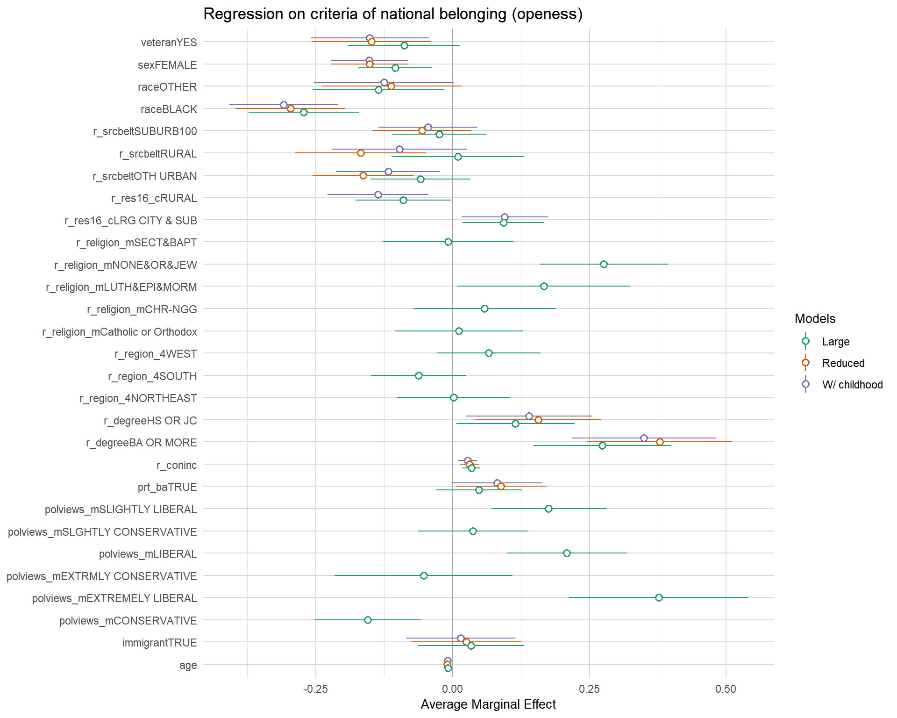
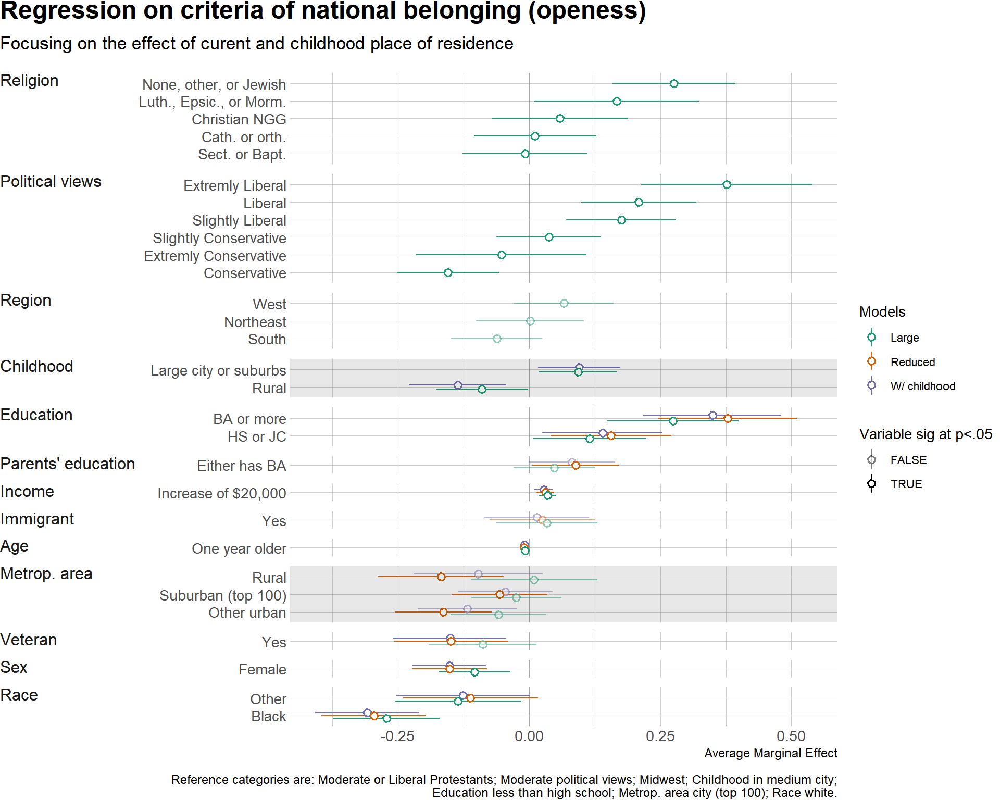

Function that orders values of coefficients from regression models, so the complex multiple models can be plotted at the same time and compared. My theme of choice is [hrbrthemes](https://github.com/hrbrmstr/hrbrthemes). Although I do not know how to include label for reference category below variable name (ideally in smaller font size, or italic) but that it remains left-aligned.

```{r setup, echo=FALSE}
knitr::opts_chunk$set(fig.path = "README_figs/README-")
```

<p float="left">
  
   
</p>

It still requires a lot of fixing with label names, as can be seen, but I am working on making it into another function.  

Function is located in 10-plot-sorting-function.R, and there are two samples of how to use it.

# Here is how to do it.

```{r, echo=FALSE}
sort_models <- function(MDS) {
  ########  REORDERING FACTORS #######
  # Function that reorders factors in multiple models for 
  # better visualisation
  # Required var names:
  # - 'full_factor' output name of the factor from lm(...);
  # - 'var' name of the variable - it has to be ordered! (alphabetic~ascending);
  # - 'factor' probably more precise of the level,
  #       it is not used in this step, since it is possible that two
  #       same levels for two different variables exist;
  # - 'AME' either average marginal effect or coefficient, numeric.
  
  
  
  
  ## 1 # assign the number of models each factor is involved to var n_mod
  MDS$n_mod <- 0
  
  TMP <- MDS %>%
    group_by(full_factor) %>%
    summarise(count = n())
  
  TMP <- as.data.frame(TMP)
  
  # because plot will be rotated, reverse the numbers so the factor with most
  # models has the lowest value - thus will be on the bottom of the plot
  
  TMP$count <- (TMP$count - (max(TMP$count) + 1)) * (-1)
  
  for (i in c(1:nrow(TMP))) {
    MDS[MDS$full_factor == TMP[i, 1], "n_mod"] <- as.numeric(TMP[i, 2])
  }
  
  ## 2 # now order according to mean estimator for each factor to n_fact
  
  MDS$n_fact <- 0
  
  TMP <- MDS %>%
    group_by(full_factor) %>%
    summarise(mean = mean(AME))
  
  TMP <- data.frame(full_factor = TMP$full_factor,
                    mean = TMP$mean)
  
  # take ranking, i.e. order of each mean 
  TMP$ordr <- rank(TMP$mean)
  
  for (i in c(1:nrow(TMP))) {
    MDS[MDS$full_factor == TMP[i, 1], "n_fact"] <- as.numeric(TMP[i, 3])
  }
  
  ## 3 # finally, the same just for whole variables
  MDS$n_var <- 0
  
  TMP <- MDS %>%
    group_by(var) %>%
    summarise(mean = mean(AME))
  
  TMP <- data.frame(var = TMP$var,
                    mean = TMP$mean)
  
  TMP$ordr <- rank(TMP$mean)
  for (i in c(1:nrow(TMP))) {
    MDS[MDS$var == TMP[i, 1], "n_var"] <- as.numeric(TMP[i, 3])
  }
  
  ### ordr # NOW CREATER ONE VARIABLE
  # it synthesises all the previous rankings according to priority
  
  MDS$ordr <- (MDS$n_mod * 10000) + (MDS$n_var * 100) + MDS$n_fact
  #MDS$ordr <- as.integer(MDS$ordr)    # this is probably unnecessary transformation 
  #MDS$ordr <- as.factor(MDS$ordr)     # this too
  
  # this is final variable that will be used for "relevel" in ggplot
  MDS$ordr <- as.integer(rank(MDS$ordr))
  
  ### v_ordr # REORDER LEVELS WITHIN var VARIABLE
  # first position of each variable according to model and mean estimators
  MDS$v_ord <- (MDS$n_mod * 10000) + (MDS$n_var * 100)
  MDS$v_ord <- as.integer(MDS$v_ord)
  # reduce the repeated values
  MDS_n <- data.frame(var = MDS$var,
                      v_ord = MDS$v_ord)
  MDS_n <- unique(MDS_n)
  # sort according to alphabet (the way they are in the original DF)
  MDS_n <- MDS_n[order(MDS_n$var), ]
  # extract numeric factor for releveling of the variable factor, it has to be
  # descenting order, because plot is rotated. And relevel factor.
  reord_lev <- order(MDS_n$v_ord, decreasing = TRUE)
  MDS$var <- factor(MDS$var, levels(MDS$var)[reord_lev])
  return(MDS)
}
```

## Libraries and creating models

```{r, message=FALSE}
library(tidyverse)
library(car)
library(margins)
library(hrbrthemes)
```

Data is from GSS, however, .sav file is too large for github, and saved in .Rdata is data already prepared for OLS in GSS_14 (20-importing-and-cleaning-data.R is how I got there).

```{r}
load("GSS14.Rdata")
## Regression -------------------------------------------------------
GSS_14$r_res16_c <- relevel(GSS_14$r_res16, ref = "CITY")
GSS_14$polviews_m <- relevel(GSS_14$polviews, ref = "MODERATE")
GSS_14$r_religion_m <- relevel(GSS_14$r_religion, ref = "MOD&LIB")

clm_small <- lm(criteria_plus ~ age + sex + race + immigrant +
                  veteran + prt_ba + r_degree + 
                  r_coninc + r_srcbelt, data = GSS_14)
clm_small_res16 <- update(clm_small, ~ . + r_res16_c)
clm_full <- update(clm_small_res16, ~ . + r_religion_m + r_region_4 +
                    polviews_m)
```

## Extract values and prepare labels, names, etc.

Now, extract the data from models. It's much easier with `tidy` from `broom` package (e.g. `mc_s <- tidy(clm_small)`), but I started with `margins` for some reason. It's just much slower, but function works best that way now. I'll be making it so it can work either way, once I finish more elegant way of renaming of variables and levels.

In total, we need five variables: `full_factor` output name of the factor from lm(...);
`var` name of the variable - it has to be ordered (alphabetic~ascending); `factor` probably more precise of the level, it is used in plotting and not sorting, since it is possible that two same levels for two different variables exist; `AME` and `lower` and `upper`.

```{r}
#### Extract coefficients (ame) ------------------------------------------------
# mc_s - small model; mc_r - model with childhood place; mc_f - full model
mc_s <- as.data.frame(summary(margins(clm_small)))
mc_r <- as.data.frame(summary(margins(clm_small_res16)))
mc_f <- as.data.frame(summary(margins(clm_full)))


#### Fix the labels and prepare them for ordering and poloting ----------------

# copy of the full name of factors from lm models which will be used later
mc_s$full_factor <- mc_s$factor
mc_r$full_factor <- mc_r$factor
mc_f$full_factor <- mc_f$factor

# create new variable with names of the variables from the model
mc_s$var <- mc_s$factor
mc_r$var <- mc_r$factor
mc_f$var <- mc_f$factor

# asing model names, so they can be distinguished
mc_s$model <- as.factor(c("Reduced"))
mc_r$model <- as.factor(c("W/ childhood"))
mc_f$model <- as.factor(c("Large"))

# first, variable names
mc_s$var <- c(
  "Age", "Immigrant", "Parents' education", "Income",
  "Education", "Education", "SMSA", "SMSA", "SMSA", "Race",
  "Race", "Sex", "Veteran"
)
mc_r$var <- c(
  "Age", "Immigrant", "Parents' education", "Income", "Education",
  "Education", "Childhood", "Childhood", "SMSA", "SMSA", "SMSA",
  "Race", "Race", "Sex", "Veteran"
)
mc_f$var <- c(
  "Age", "Immigrant", "Political views", "Political views",
  "Political views", "Political views", "Political views",
  "Political views", "Parents' education", "Income", "Education",
  "Education", "Region", "Region", "Region", "Religion",
  "Religion", "Religion", "Religion", "Religion", "Childhood",
  "Childhood", "SMSA", "SMSA", "SMSA", "Race", "Race", "Sex", "Veteran"
)

## remove variable name from the name of the factor

mc_s$factor <- c(
  "One year older", "Yes", "Either has BA", "Increase of $20,000",
  "BA or more", "HS or JC", "Other urban", "Rural",
  "Suburban (top 100)", "Black", "Other", "Female", "Yes"
)
mc_r$factor <- c(
  "One year older", "Yes", "Either has BA", "Increase of $20,000",
  "BA or more", "HS or JC", "Large city or suburbs", "Rural",
  "Other urban", "Rural", "Suburban (top 100)", "Black",
  "Other", "Female", "Yes"
)
mc_f$factor <- c(
  "One year older", "Yes", 
  "Conservative", "Extremly Liberal",
  "Extremly Conservative", "Liberal", 
  "Slightly Conservative", "Slightly Liberal", 
  "Either has BA", "Increase of $20,000",
  "BA or more", "HS or JC", 
  "Northeast", "South",
  "West", "Cath. or orth.", 
  "Christian NGG", "Luth., Epsic., or Morm.",
  "None, other, or Jewish", "Sect. or Bapt.",
  "Large city or suburbs","Rural", 
  "Other urban", "Rural", 
  "Suburban (top 100)", 
  "Black","Other",
  "Female", "Yes"
)
```

Now, we combine all three models into one, so they can be ordered and plotted.

```{r}
MB <- rbind(mc_f, mc_s)
MB <- rbind(MB, mc_r)

## make all the labels to be factors
MB$full_factor <- as.factor(MB$full_factor)
MB$factor <- as.factor(MB$factor)
MB$var <- as.factor(MB$var)

```

## Use the function and sort

And we just call the sorting function. It reorders levels in `var` that will be used for faceting, and adds `ordr` to the data frame that will be used for ordering of values. It does it quite crudely, using numbers and additions, but it works. Several "rules" are followed: 1. variable levels are ordered according to the size of the mean values for all applicable models; 2. variables are ordered according to the number of models they are involved with (most models in the bottom); and 3. variables are ordered according to total mean of all values in them.

```{r}
MB <- sort_models(MB)
```

## Additional fixing so the plot is nicer

Some more fixing before plotting - new line in variable names that includes a reference category.

```{r}
levels(MB$var)
levels(MB$var)[1] <- "Religion\n[ref: mod. or lib. prot.]"
levels(MB$var)[2] <- "Political views\n[ref: moderate]"
levels(MB$var)[3] <- "Region\n[ref: Midwest]"
levels(MB$var)[4] <- "Childhood\n[ref: medium city]"
levels(MB$var)[5] <- "Education\n[ref: LT HS]"
levels(MB$var)[10] <- "Metrop. area\n[ref: city (top 100)]"
levels(MB$var)[13] <- "Race\n[ref: white]"
```

Since not variables as whole might not be stat. significant in the models, and thus would be just adding to the clutter (e.g. especially categorical ones), they can be identified and their alpha reduced. A new logical variable in dataframe is useful for that, and the values are manually assigned (at this point). This also allows, for example, to easily see in what models certain categorical variable as whole looses significance.

```{r}
MB$sig <- TRUE

Anova(clm_full)
Anova(clm_small)
Anova(clm_small_res16)

MB$sig[MB$var == "Immigrant"] <- FALSE
MB$sig[(MB$var == "Veteran") &
       (MB$model == "Large")] <- FALSE
MB$sig[(MB$var == "Parents' education") &
       (MB$model == "Large")] <- FALSE
MB$sig[(MB$var == "Metrop. area\n[ref: city (top 100)]") &
       (MB$model == "Large")] <- FALSE
MB$sig[(MB$var == "Region\n[ref: Midwest]") &
       (MB$model == "Large")] <- FALSE
MB$sig[(MB$var == "Parents' education") &
       (MB$model == "W/ childhood")] <- FALSE
MB$sig[(MB$var == "Metrop. area\n[ref: city (top 100)]") &
       (MB$model == "W/ childhood")] <- FALSE
```

If there are specific variables we are interested in, as I was, their background can be shaded to draw attention. Since plot is going to be faceted, adding full width/length geom_rect that has also same main variables is one option. Thus, we are going to assign NA values to all the facets, and add (-)Infs to variables we are interested in.

```{r}
intrst <- data.frame(var = unique(MB$var),
                     xmn = NA,
                     xmx = NA,
                     ymn = NA,
                     ymx = NA
                     )

intrst[ 9, 2:5] <- c(-Inf, Inf, -Inf, Inf)
intrst[10, 2:5] <- c(-Inf, Inf, -Inf, Inf)
```

## Ploting

Finally, to plot the data `ordr` should be used to reorder variable `factor` (it contains levels of categorical variables, or units of non-categorical and since it was not used in creation of the `ordr` var it can contain same names for different variables).

```{r}
p_m <- ggplot(data = MB, aes(x = reorder(factor, ordr),
                             y = AME,
                             ymin = lower,
                             ymax = upper,
                             colour = model,
                             alpha = sig)
              )

# add marginal effects
p_m <- p_m +
  geom_pointrange(position = position_dodge(width = 0.5),
                  shape = 21,
                  fill = "white"
                  ) +
  scale_colour_manual(values = c("#1b9e77", "#d95f02", "#7570b3"))

# make vars. that do not reach stat.sig. transparent
p_m <- p_m + scale_alpha_discrete(range = c(0.5, 1.0))

# add intercept line
p_m <- p_m + geom_hline(yintercept = 0,
                        color = "dark gray")

# rotate plot and add some labels
p_m <- p_m +
  coord_flip() +
  labs(x = NULL,
       y = "Average Marginal Effect",
       colour = "Models",
       alpha = "Variable\nsig at p<.05",
       title = "Regression on criteria of national belonging (openess)")

# add facets according to model variables
# order of levels is going to take care of variable order
p_m <- p_m + facet_grid(var ~ . ,           
                        scales = "free_y",
                        space = "free_y",
                        switch = "y")

# fix the appearance of the plot
p_m <- p_m + 
  theme(strip.text.y = element_text(angle = 180),
        strip.placement = "outside",
        strip.background = element_rect(fill = "#d9d9d9", color = NA),
        plot.background = element_blank(),
        panel.background = element_blank(),
        panel.grid.major.x = element_line(colour = "#d9d9d9"),
        panel.grid.minor.x = element_line(colour = "#d9d9d9"),
        panel.grid.major.y = element_line(colour = "#d9d9d9"),
        panel.grid.minor.y = element_line(colour = "#d9d9d9"),
        axis.ticks = element_blank(),
        legend.key = element_blank(),
        legend.background = element_blank(),
        legend.box.background = element_blank(),
        legend.title = element_text(size = 10),
        axis.title =  element_text(size = 10),
        title = element_text(size = 11)
  )

# add rectangles to highlight variables we are interested in
p_m <- p_m + geom_rect(data = intrst,
                       aes(xmin = xmn,
                           xmax = xmx,
                           ymin = ymn,
                           ymax = ymx),
                       alpha = 0.09,
                       fill = "black",
                       inherit.aes = FALSE,
                       show.legend = FALSE
                       )
```

And this is how finished plot looks like, it does include several warnings, which are for facets that are not shaded.

```{r first-plot, fig.height=7}
# finished plot
p_m
```

## Post-plot-fixing

But, the title comes awkwardly in the middle, to fix it we need to use `ggplotGrob` and `grid.draw` from `grid` package.

```{r second-plot, warning=FALSE, fig.height=7}
p_m_fix <- ggplotGrob(p_m)
p_m_fix$layout$l[p_m_fix$layout$name == "title"] <- 2
grid::grid.draw(p_m_fix)
```

It's all fairly simple, but the function cuts a lot of lines. It can also be cut more, and I'll be trying to do it. :)

If you have any suggestion on how to further improve the plot, I would be thrilled to hear it!